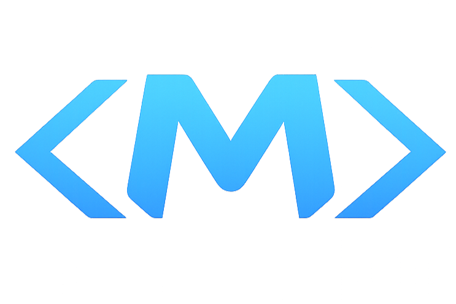

# Madimran | Full Stack Developer Portfolio

<div align="center">
  
  <br />
  <h3>
    <a href="https://portfolio-dun-omega-55.vercel.app/">🔴 LIVE DEMO</a>
  </h3>
  <p>
    My personal portfolio website showcasing my projects, skills, and experience.
    <br />
    Built with modern web technologies and a focus on clean, responsive design.
  </p>
</div>

---

## 🚀 Overview

This portfolio serves as a central hub for my work as a **Full Stack Developer** and **Mobile & Web Specialist**. It features a dynamic layout, interactive elements, and a clean UI to present my professional journey.

## ✨ Features

- **Responsive Design**: Fully optimized for mobile, tablet, and desktop.
- **Modern UI**: Clean aesthetics with a custom design system.
- **Project Showcase**: Detailed cards for my key projects (StyleIt, ProofPay, CrowdCheck).
- **Interactive Elements**: Smooth scrolling, hover effects, and animations using Framer Motion.
- **Contact Integration**: direct links to GitHub, LinkedIn, and Email.

## 🛠️ Tech Stack

- **Frontend**: React, Vite
- **Styling**: Vanilla CSS (Custom Architected), Framer Motion
- **Icons**: React Icons (FontAwesome, SimpleIcons)
- **Deployment**: Vercel

## 🏃‍♂️ Running Locally

1.  **Clone the repo**
    ```bash
    git clone https://github.com/Madimrann/portfolio.git
    cd portfolio
    ```

2.  **Install dependencies**
    ```bash
    npm install
    ```

3.  **Start the dev server**
    ```bash
    npm run dev
    ```

4.  Open `http://localhost:5173` in your browser.

---

© 2026 Muhammad Adib Imran. All Rights Reserved.
